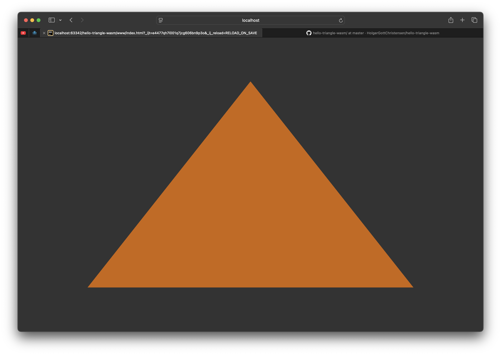

# Compile the example

## Install the target
`rustup target add wasm32-unknown-unknown `

## Install wasm-bindgen
`cargo install -f wasm-bindgen-cli`

## Compile the example
`cargo build --target wasm32-unknown-unknown`

## Run bindgen
`wasm-bindgen target/wasm32-unknown-unknown/debug/hello-triangle-wasm.wasm --target web --no-typescript --out-dir www --out-name hello-triangle-wasm
`